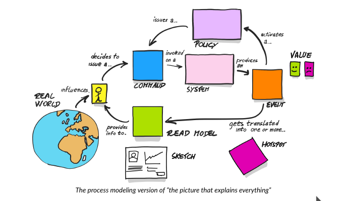

## Spis treści

## Intro

Jest to projekt systemu wspomagającego rekrutację uczniów do szkół ponadpodstawowych. Proces jest całkowicie wymyślony i ma niewiele wspólnego
 z rzeczywistością, umożliwia jednak realizację celu jakim jest doskonalenie praktycznych umiejętności w zakresie
  eksploracji dziedziny przy użyciu technik zaczerpniętych z Domain Driven Design.
  
Nasz  miniprojekt samorozwojowy realizowaliśmy w kilkuosobowym zespole:

* Ruslan Pidhainyi - todo link
* Tomek Przybylski - todo link
* Mariusz Olbryś - todo link
* Gabriel Kurzac - todo link
* Mariusz Wójcik - todo link

Spotykaliśmy się na cotygodniowych, dwugodzinnych sesjach online na których realizowaliśmy kolejne etapy eksploracji dziedziny przy użyciu techniki
 Event Stormingu . 
 
 Naszym przewodnikiem była pozycja absolutnie zasadnicza:
 [Introducing EventStorming-Alberto Brandolini](https://leanpub.com/introducing_eventstorming). 
 Podczas naszych sesji staraliśmy się czerpać z niej całymi garściami...
 
 Wykorzystaliśmy narzędzia umożliwiające nam pracę zdalną: 
 
 * Google Meeting
 * [miro.com](http://www.miro.com)
   
## Eskploracja domeny - Big Picture

#### The picture that explains everything

This nice picture comes from [Introducing EventStorming-Alberto Brandolini](https://leanpub.com/introducing_eventstorming).

 

<!--
## Domain exploration
### EventStorming - general assumptions

#### Phase 1 - Big Picture
It has the character of a workshop aimed at discovery **hot spots** . 
Hot spot can mean:
* lack of expert knowledge (regarding this part of the process)
* uncertainty
* risk

The modeling space is **timeline** .

##### Stage 1 - finding unordered events
Workshop participants search for events that are important in their process.   At the beginning, no chronology is allowed. 
 
##### Stage 2 - ordering on the timeline
At this stage, the events are arranged in chronological order. 

##### Stage 3 - reversing the narrative
In this step the consistency check is performed. Participants analyze events from the end to the beginning and reflect on what must happen before .

##### Stage 4 - identyfing actors
Workshop participants successively analyze the events and identify their sources. The event source can be an actor or other system. 

##### Stage 5 - identyfing hot spots
In this step, hot spots are identified, i.e. places that are undefined and require special attention

#### Phase 2 - Process Modelling
The goal is to implement future that solve a specific problem. The modeling space is **timeline** . At this stage, workshop participants identify autonomous 
fragments of the process which are the basis for isolating separate Bounded Context. At this stage, workshop participants identify autonomy fragments of the process, 
which are the basis for the identification of separate Limited Contexts, and look for the possibility of process optimization.  

Diagrams are detailed, new, more precise elements are introduced. Finally, aggregates are distinguished.
-->

<!--
### Secondary School Recruitment System - domain exploration - Big Picture 

#### Events

<a href="https://raw.githubusercontent.com/mwwojcik/secondary-school-recruitment-system/master/img/recruiment-big-picture-events.png" target="_blank">Show
 picture
</a>

#### Events arranged in chronological order

<a href="https://raw.githubusercontent.com/mwwojcik/secondary-school-recruitment-system/master/img/recruiment-big-picture-events-timeline.png" target="_blank">Show
 picture
</a>

-->