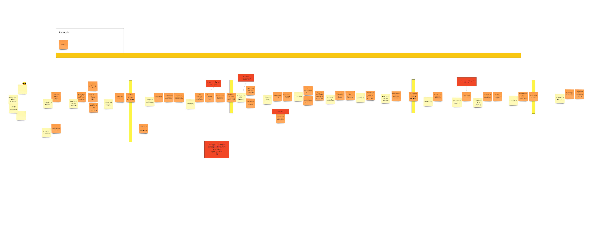

## Spis treści

## Intro

Jest to projekt systemu wspomagającego rekrutację uczniów do szkół ponadpodstawowych. Proces jest całkowicie wymyślony i ma niewiele wspólnego
 z rzeczywistością, umożliwia jednak realizację celu jakim jest doskonalenie praktycznych umiejętności w zakresie
  eksploracji dziedziny przy użyciu technik zaczerpniętych z Domain Driven Design.
  
Projekt realizowany jest w kilkuosobowym zespole:

* Ruslan Pidhainyi - todo link
* Tomek Przybylski - todo link
* Mariusz Olbryś - todo link
* Gabriel Kurzac - todo link
* Mariusz Wójcik - todo link

 
 Spotkania odbywają się w trybie zdalnym przy wykorzystaniu narzędzi: 
 
 * Google Meeting
 * [miro.com](http://www.miro.com)

   
## ETAP I - Eskploracja domeny - Big Picture

Rozpoznawanie dziedziny rozpoczyna się od wypracowania sobie jej ogólnego, aktualnego obrazu. Służy temu pierwsza faza eksloracji zwana **Big Picture**.  
Jej celem jest zobrazowanie aktualnego przebiegu procesu biznesowego oraz identyfikacja ryzyk, niedogodności i problemów które w nim występują.   

Składa się na nią kilka faz:

* Chaotyczna eksploracja
* Oś czasu
* Identyfiacja aktorów i systemów emitujących zdarzenia
* Opowieść (od początku do końca)
* Retrospektywa (analiza od końca do początku)
* Identyfikacja ryzyk

### Notacja

 

*źródło: [Introducing EventStorming-Alberto Brandolini](https://leanpub.com/introducing_eventstorming)*

Na etapie Big Picture najważniejsza jest pomarańczowa karteczka symbolizująca Zdarzenie - coś ważnego co zaszło  w procesie.

### Chaotyczna eksploracja
Na tym etapie każdy z uczestników warsztatu umieszczał zdarzenia które wydawały mu się zasadne. Był to proces bardzo chaotyczny, zdarzenia się dublowały, 
powstawały bez konsultacji z innymi uczestnikami. 
 

<a href="https://raw.githubusercontent.com/mwwojcik/secondary-school-recruitment-system/master/img/ES-training-big-picture-chaotic.jpg" target="_blank
">Pokaż</a>

### Oś czasu

Na tym etapie następuje porządkowanie zdarzeń - nadanie im chronologii. Czasami jest to bardzo trudne, wtedy dopuszczone są techniki wspomagające (strategie
 sortowania) . 
 
 Wśród nich wyróżnić można:
 
 * Pivotal events ( zdarzenia kluczowe - Pivotal Events) - technika ta polega na wyróżnieniu kilku zdarzeń, które wydają się najważniejsze. Inne zdarzenia s
 ą porządkowane względem nich, po zadaniu pytania czy to zdarzenie stało się wcześniej , czy później względem najbliszego PE.
 
 * Swimlanes - na tablicy wprowadza się linie poziome tworzące osobne obszary reprezentująca poszczególne działy i jednostki organizacjyjne biorące udział w procesie.
 Zdarzenia układane są chronologicznie, ale przyporządkowywane do odpowiedniej partycji.  
 
 * Milestones - strategia ta polega na określeniu na tablicy określonych punktów w czasie np. (1 rok wcześniej, 3mce wcześniej, itd.) - zdarzenia układa si
 ę umiejscawiając je w "przypuszczlnej" ramce.
 
 * Chapters - technika ta polega na wykorzystaniu opowiadanej historii. Dzieli się ją na rozdziały i w ich ramach porządkowane są zdarzenia.
 
 * Strategia mieszana - zgodnie z ideą ES nic nie jest stałe i strategie można dowolnie ze sobą mieszać.
 
 W przypadku systemu rekrutacji zastosowana została technika Pivotal Events. Każde ze zdarzeń kluczowych wyróżnione zostało pionową kreską ułatwiająca
  
  umiejscawianie zdarzeń poprzedzających lub następnych.
 
 
 Wynik :

<a href="https://raw.githubusercontent.com/mwwojcik/secondary-school-recruitment-system/master/img/ES-training-bigpicture-timeline.jpg" target="_blank
">Pokaż</a>

### Identyfiacja aktorów i systemów emitujących zdarzenia

Na tym etapie następuje próba identyfikacji osób i systemów biorących udział w procesie. 

<a href="https://raw.githubusercontent.com/mwwojcik/secondary-school-recruitment-system/master/img/ES-training-bigpicture-actors.jpg" target="_blank
">Pokaż</a>

### Opowieść (od początku do końca) i retrospektywa (analiza od końca do początku)

Celem kolejnego kroku jest dalsze uspójnienie dosyć dobrze już zarysowanego procesu. 

Służy temu analiza kolejnych zdarzeń , a środkiem wyrazu jest opowieść snuta najpierw od początku do końca, a następnie od końca do początku. 

W wyniku tych opowieści ujawniają się miejsca niespójne, w których jedno zdarzenie nie wynika z drugigo. Jest to znak że należy dokładniej przyjrzeć się temu 

fragmentowi procesu. Może okazać się że coś nieprawidłowo zostało osadzone w czasie, albo że czegoś brakuje.

Narracja od początku do końca pokazuje że coś co wydawało się już spójne w wielu miejscach wymaga doprecyzowania. 

Jeszcze ciekawsze efekty przynosi narracja odwrotna. Tutaj przy każdym głośno wypowiedzianym zdarzeniu należy zastanowić się czy jest ono bezpośrednim 

następstwem poprzedniego. 

Bardzo ważnym elementem towarzyszącym jest powszechna dyskusja.   

 Wynik :

<a href="https://raw.githubusercontent.com/mwwojcik/secondary-school-recruitment-system/master/img/ES-training-retro.jpg" target="_blank
">Pokaż</a>

### Identyfikacja ryzyk 

<!--
## Domain exploration
### EventStorming - general assumptions

#### Phase 1 - Big Picture
It has the character of a workshop aimed at discovery **hot spots** . 
Hot spot can mean:
* lack of expert knowledge (regarding this part of the process)
* uncertainty
* risk

The modeling space is **timeline** .

##### Stage 1 - finding unordered events
Workshop participants search for events that are important in their process.   At the beginning, no chronology is allowed. 
 
##### Stage 2 - ordering on the timeline
At this stage, the events are arranged in chronological order. 

##### Stage 3 - reversing the narrative
In this step the consistency check is performed. Participants analyze events from the end to the beginning and reflect on what must happen before .

##### Stage 4 - identyfing actors
Workshop participants successively analyze the events and identify their sources. The event source can be an actor or other system. 

##### Stage 5 - identyfing hot spots
In this step, hot spots are identified, i.e. places that are undefined and require special attention

#### Phase 2 - Process Modelling
The goal is to implement future that solve a specific problem. The modeling space is **timeline** . At this stage, workshop participants identify autonomous 
fragments of the process which are the basis for isolating separate Bounded Context. At this stage, workshop participants identify autonomy fragments of the process, 
which are the basis for the identification of separate Limited Contexts, and look for the possibility of process optimization.  

Diagrams are detailed, new, more precise elements are introduced. Finally, aggregates are distinguished.
-->

<!--
### Secondary School Recruitment System - domain exploration - Big Picture 

#### Events

<a href="https://raw.githubusercontent.com/mwwojcik/secondary-school-recruitment-system/master/img/recruiment-big-picture-events.png" target="_blank">Show
 picture
</a>

#### Events arranged in chronological order

<a href="https://raw.githubusercontent.com/mwwojcik/secondary-school-recruitment-system/master/img/recruiment-big-picture-events-timeline.png" target="_blank">Show
 picture
</a>

-->